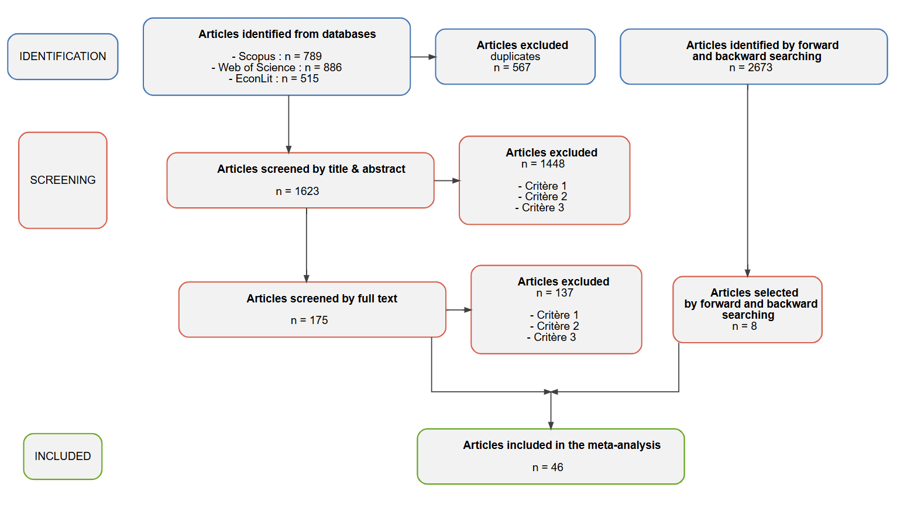

# Mécanismes

- Santé / capacités physiques : mortalité, maladies cardiovasculaires et pulmonaires, maux de tête, problèmes respiratoires, fatigue...

- Capacités cognitives : perturbation de l'oxygénation cérébrale

- Effets même à de faibles niveaux de pollution

→ Diminution de l'efficacité des travailleurs

# Méthodologie

- Screening de la littérature empirique (titre et résumé, puis texte intégral) à partir d'une chaîne de recherche construite à l'aide de papiers identifiés comme pionniers, sur Scopus, EconLit et Web of Science

- Création d'une base de données : une observation = un coefficient transformé en élasticité ; les caractéristiques de chaque coefficient sont renseignées dans la base (fixed effects, population, type de polluant...)

- Prochaines étapes : analyses économétriques de l'hétérogénéité des coefficients

#

# Mesures de la productivité

- Mesures conventionnelles : VA/travailleur, output/travailleur, piece-rate contracts

- Wages

- Financial index (ex. rendements du S&P 500, abnormal performance

- Physical performance (ex. nombre de passes/match/travailleur)

- Time efficiency : temps consacré par unité de production / travailleur (ex. audiences, dossiers)

- Cognitive performance

- Output 

# Enjeux

- Fréquence des données

- Niveau d'agrégation

- Mesure de la productivité

→ Y semble être influencé par la pollution de l'air via d'autres canaux que la seule efficacité du travailleur : demande, intensité capital/travail (K/L), rôle des managers, etc.